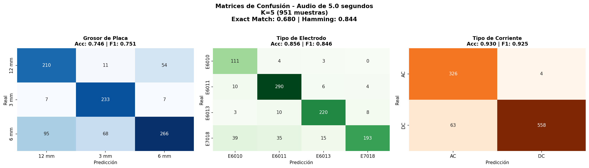
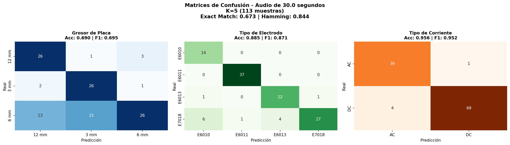
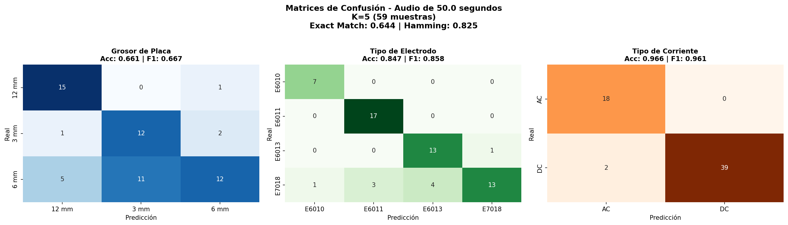

# Resultados del Modelo de Clasificación SMAW

## I. Comparación: Audios Preprocesados vs Audios Crudos

Se realizaron dos series de experimentos para comparar el rendimiento del modelo con diferentes tipos de audio:

1. **Audios Preprocesados:** Audio procesado con Spleeter para separación de fuentes y aumento de ganancia (gain)
2. **Audios Crudos:** Audio sin preprocesamiento, directamente desde la captura

### Resultados en Conjunto Blind (Generalización Real)

El conjunto blind contiene sesiones de soldadura nunca vistas durante el entrenamiento, representando condiciones de uso real.

#### Comparación por Duración de Segmento (Accuracy)

| Duración   | Parámetro | Preprocesados | Crudos | Diferencia |
| ---------- | --------- | ------------- | ------ | ---------- |
| **5 seg**  | Placa     | 0.7279        | 0.7413 | +0.0134    |
| **5 seg**  | Electrodo | 0.8233        | 0.8570 | +0.0337    |
| **5 seg**  | Corriente | 0.9674        | 0.9369 | -0.0305    |
| **10 seg** | Placa     | 0.7455        | 0.7539 | +0.0084    |
| **10 seg** | Electrodo | 0.8705        | 0.8613 | -0.0092    |
| **10 seg** | Corriente | 0.9821        | 0.9709 | -0.0112    |
| **20 seg** | Placa     | -             | 0.7337 | -          |
| **20 seg** | Electrodo | -             | 0.8794 | -          |
| **20 seg** | Corriente | -             | 0.9648 | -          |
| **30 seg** | Placa     | 0.8046        | 0.6903 | -0.1143    |
| **30 seg** | Electrodo | 0.8966        | 0.8850 | -0.0116    |
| **30 seg** | Corriente | 0.9770        | 0.9558 | -0.0212    |
| **50 seg** | Placa     | -             | 0.6610 | -          |
| **50 seg** | Electrodo | -             | 0.8475 | -          |
| **50 seg** | Corriente | -             | 0.9661 | -          |

#### Comparación por F1-Score (Macro)

| Duración   | Parámetro | Preprocesados | Crudos | Diferencia |
| ---------- | --------- | ------------- | ------ | ---------- |
| **5 seg**  | Placa     | 0.7300        | 0.7469 | +0.0169    |
| **5 seg**  | Electrodo | 0.8200        | 0.8446 | +0.0246    |
| **5 seg**  | Corriente | 0.9700        | 0.9327 | -0.0373    |
| **10 seg** | Placa     | 0.7500        | 0.7601 | +0.0101    |
| **10 seg** | Electrodo | 0.8700        | 0.8525 | -0.0175    |
| **10 seg** | Corriente | 0.9800        | 0.9687 | -0.0113    |
| **20 seg** | Placa     | -             | 0.7376 | -          |
| **20 seg** | Electrodo | -             | 0.8745 | -          |
| **20 seg** | Corriente | -             | 0.9620 | -          |
| **30 seg** | Placa     | 0.8100        | 0.6946 | -0.1154    |
| **30 seg** | Electrodo | 0.9000        | 0.8712 | -0.0288    |
| **30 seg** | Corriente | 0.9800        | 0.9524 | -0.0276    |
| **50 seg** | Placa     | -             | 0.6668 | -          |
| **50 seg** | Electrodo | -             | 0.8585 | -          |
| **50 seg** | Corriente | -             | 0.9612 | -          |


## II. Evaluación durante Entrenamiento (Validacion Cruzada K-Fold)

En las métricas que mencionan "Fold", el valor corresponde al promedio de accuracy obtenido en cada partición (fold) durante la validacion cruzada K-Fold. Este promedio refleja el rendimiento del modelo individual en cada fold antes de combinarlos en el ensamble.

Los resultados de validacion cruzada representan el rendimiento del modelo evaluado en los datos de entrenamiento mediante K-Fold. Cada fold se entrena con K-1 particiónes y se evalua en la partición restante, rotando hasta cubrir todos los datos.

### Audio de 1 segundo

**Fecha de ejecución:** 2026-01-22  
**Total de segmentos:** 38,182 | **Sesiones únicas:** 335

| Parámetro     | Accuracy Promedio Fold | Accuracy Ensemble | F1 Macro Ensemble |
| ------------- | ---------------------- | ----------------- | ----------------- |
| **Placa**     | 0.0000                 | 0.3358            | 0.1689            |
| **Electrodo** | 0.0000                 | 0.1543            | 0.0413            |
| **Corriente** | 0.0000                 | 0.4032            | 0.2317            |

El modelo con segmentos de 1 segundo presenta rendimiento muy bajo. VGGish produce solo 1 frame de embedding para 1s de audio, lo cual no provee suficiente contexto temporal para la clasificación multi-tarea.

### Audio de 2 segundos

**Fecha de ejecución:** 2026-01-22  
**Total de segmentos:** 18,848 | **Sesiones únicas:** 335

| Parámetro     | Accuracy Promedio Fold | Accuracy Ensemble | F1 Macro Ensemble |
| ------------- | ---------------------- | ----------------- | ----------------- |
| **Placa**     | 0.7815                 | 0.9140            | 0.9138            |
| **Electrodo** | 0.8382                 | 0.9442            | 0.9444            |
| **Corriente** | 0.9604                 | 0.9928            | 0.9928            |

### Audio de 5 segundos

**Fecha de ejecución:** 2026-01-21  
**Total de segmentos:** 7,234 | **Sesiones únicas:** 335

| Parámetro     | Accuracy Promedio Fold | F1 Macro Ensemble | Mejora Ensemble |
| ------------- | ---------------------- | ----------------- | --------------- |
| **Placa**     | 0.8464                 | 1.0000            | +0.1536         |
| **Electrodo** | 0.9312                 | 0.9996            | +0.0684         |
| **Corriente** | 0.9903                 | 1.0000            | +0.0097         |

### Comparación de K (5 segundos)

**Fecha de ejecución:** 2026-02-01  
**Fuente:** [5seg/results.json](5seg/results.json)

| K  | Acc Fold (Placa) | Acc Fold (Electrodo) | Acc Fold (Corriente) | Acc Ensemble (Placa) | Acc Ensemble (Electrodo) | Acc Ensemble (Corriente) |
| -- | ---------------- | -------------------- | -------------------- | -------------------- | ------------------------ | ------------------------ |
| 3  | 0.8484           | 0.9225               | 0.9819               | 0.9961               | 0.9956                   | 0.9999                   |
| 5  | 0.8600           | 0.9180               | 0.9856               | 0.9981               | 0.9989                   | 1.0000                   |
| 7  | 0.8589           | 0.9258               | 0.9864               | 0.9989               | 0.9989                   | 1.0000                   |
| 10 | 0.8674           | 0.9281               | 0.9865               | 0.9997               | 0.9996                   | 1.0000                   |
| 15 | 0.8756           | 0.9277               | 0.9870               | 0.9997               | 0.9993                   | 1.0000                   |
| 20 | 0.8781           | 0.9331               | 0.9857               | 0.9975               | 0.9979                   | 1.0000                   |

### Audio de 10 segundos

**Fecha de ejecución:** 2026-01-21  
**Total de segmentos:** 3,372 | **Sesiones únicas:** 335

| Parámetro     | Accuracy Promedio Fold | F1 Macro Ensemble | Mejora Ensemble |
| ------------- | ---------------------- | ----------------- | --------------- |
| **Placa**     | 0.8845                 | 1.0000            | +0.1155         |
| **Electrodo** | 0.9507                 | 0.9997            | +0.0490         |
| **Corriente** | 0.9888                 | 1.0000            | +0.0112         |

### Comparación de K (10 segundos)

**Fecha de ejecución:** 2026-01-31  
**Fuente:** [10seg/results.json](10seg/results.json)

| K  | Acc Fold (Placa) | Acc Fold (Electrodo) | Acc Fold (Corriente) | Acc Ensemble (Placa) | Acc Ensemble (Electrodo) | Acc Ensemble (Corriente) |
| -- | ---------------- | -------------------- | -------------------- | -------------------- | ------------------------ | ------------------------ |
| 3  | 0.8833           | 0.9415               | 0.9911               | 0.9997               | 0.9994                   | 1.0000                   |
| 5  | 0.8845           | 0.9507               | 0.9888               | 1.0000               | 0.9997                   | 1.0000                   |
| 7  | 0.8961           | 0.9482               | 0.9908               | 1.0000               | 1.0000                   | 1.0000                   |
| 10 | 0.9045           | 0.9522               | 0.9907               | 1.0000               | 1.0000                   | 1.0000                   |
| 15 | 0.9136           | 0.9561               | 0.9924               | 1.0000               | 1.0000                   | 1.0000                   |
| 20 | 0.9063           | 0.9582               | 0.9939               | 1.0000               | 1.0000                   | 1.0000                   |

### Audio de 20 segundos

**Fecha de ejecución:** 2026-01-30  
**Total de segmentos:** 1,441 | **Sesiones únicas:** 335

| Parámetro     | Accuracy Promedio Fold | Accuracy Ensemble | F1 Macro Ensemble |
| ------------- | ---------------------- | ----------------- | ----------------- |
| **Placa**     | 0.9140                 | 1.0000            | 1.0000            |
| **Electrodo** | 0.9545                 | 1.0000            | 1.0000            |
| **Corriente** | 0.9895                 | 1.0000            | 1.0000            |

### Audio de 30 segundos

**Fecha de ejecución:** 2026-01-21  
**Total de segmentos:** 805 | **Sesiones únicas:** 335

| Parámetro     | Accuracy Promedio Fold | F1 Macro Ensemble | Mejora Ensemble |
| ------------- | ---------------------- | ----------------- | --------------- |
| **Placa**     | 0.9343                 | 1.0000            | +0.0657         |
| **Electrodo** | 0.9641                 | 1.0000            | +0.0359         |
| **Corriente** | 0.9903                 | 1.0000            | +0.0097         |

### Audio de 50 segundos

**Fecha de ejecución:** 2026-01-31  
**Total de segmentos:** 389 | **Sesiones únicas:** 335

| Parámetro     | Accuracy Promedio Fold | Accuracy Ensemble | F1 Macro Ensemble |
| ------------- | ---------------------- | ----------------- | ----------------- |
| **Placa**     | 0.9453                 | 1.0000            | 1.0000            |
| **Electrodo** | 0.9620                 | 1.0000            | 1.0000            |
| **Corriente** | 0.9901                 | 1.0000            | 1.0000            |

## III. Evaluación en Conjunto Blind

El conjunto blind contiene sesiones de soldadura que nunca fueron vistas durante el entrenamiento, lo que permite medir la capacidad de generalización real del modelo ante datos nuevos.

### Audio de 1 segundo

**Tamaño del conjunto:** 4,988 segmentos

| Parámetro     | Accuracy | F1 (Macro) | Precision (Macro) | Recall (Macro) |
| ------------- | -------- | ---------- | ----------------- | -------------- |
| **Placa**     | 0.2905   | 0.1501     | 0.0968            | 0.3333         |
| **Electrodo** | 0.1249   | 0.0555     | 0.0312            | 0.2500         |
| **Corriente** | 0.3464   | 0.2573     | 0.1732            | 0.5000         |

**Matriz de confusión (1 segundo):**


### Audio de 2 segundos

**Tamaño del conjunto:** 2,465 segmentos

| Parámetro     | Accuracy | F1 (Macro) | Precision (Macro) | Recall (Macro) |
| ------------- | -------- | ---------- | ----------------- | -------------- |
| **Placa**     | 0.6953   | 0.7009     | 0.6979            | 0.7260         |
| **Electrodo** | 0.7696   | 0.7564     | 0.7570            | 0.7766         |
| **Corriente** | 0.8815   | 0.8761     | 0.8689            | 0.9019         |

**Matriz de confusión (2 segundos):**


### Audio de 5 segundos

**Tamaño del conjunto:** 951 segmentos

| Parámetro     | Accuracy | F1 (Macro) | Precision (Macro) | Recall (Macro) |
| ------------- | -------- | ---------- | ----------------- | -------------- |
| **Placa**     | 0.7497   | 0.7557     | 0.7492            | 0.7792         |
| **Electrodo** | 0.8486   | 0.8379     | 0.8369            | 0.8595         |
| **Corriente** | 0.9317   | 0.9273     | 0.9176            | 0.9455         |

**Matriz de confusión (5 segundos):**



### Audio de 10 segundos

**Tamaño del conjunto:** 447 segmentos

| Parámetro     | Accuracy | F1 (Macro) | Precision (Macro) | Recall (Macro) |
| ------------- | -------- | ---------- | ----------------- | -------------- |
| **Placa**     | 0.7539   | 0.7601     | 0.7544            | 0.7907         |
| **Electrodo** | 0.8613   | 0.8525     | 0.8501            | 0.8792         |
| **Corriente** | 0.9709   | 0.9687     | 0.9620            | 0.9775         |

**Matriz de confusión (10 segundos):**


### Audio de 20 segundos

**Tamaño del conjunto:** 199 segmentos

| Parámetro     | Accuracy | F1 (Macro) | Precision (Macro) | Recall (Macro) |
| ------------- | -------- | ---------- | ----------------- | -------------- |
| **Placa**     | 0.7337   | 0.7376     | 0.7399            | 0.7765         |
| **Electrodo** | 0.8794   | 0.8745     | 0.8703            | 0.8965         |
| **Corriente** | 0.9648   | 0.9620     | 0.9534            | 0.9747         |

**Matriz de confusión (20 segundos):**


### Audio de 30 segundos

**Tamaño del conjunto:** 113 segmentos (87 sesiones)

| Parámetro     | Accuracy | F1 (Macro) | Precision (Macro) | Recall (Macro) |
| ------------- | -------- | ---------- | ----------------- | -------------- |
| **Placa**     | 0.6903   | 0.6946     | 0.7066            | 0.7482         |
| **Electrodo** | 0.8850   | 0.8712     | 0.8627            | 0.9068         |
| **Corriente** | 0.9558   | 0.9524     | 0.9463            | 0.9601         |

**Matriz de confusión (30 segundos):**



### Audio de 50 segundos

**Tamaño del conjunto:** 59 segmentos

| Parámetro     | Accuracy | F1 (Macro) | Precision (Macro) | Recall (Macro) |
| ------------- | -------- | ---------- | ----------------- | -------------- |
| **Placa**     | 0.6610   | 0.6668     | 0.6787            | 0.7220         |
| **Electrodo** | 0.8475   | 0.8585     | 0.8773            | 0.8563         |
| **Corriente** | 0.9661   | 0.9612     | 0.9535            | 0.9720         |

**Matriz de confusión (50 segundos):**



## IV. Comparación General (Audios Crudos)

### 1 segundo

| Parámetro     | Evaluación Entrenamiento (K-Fold) | Blind Test | Diferencia |
| ------------- | --------------------------------- | ---------- | ---------- |
| **Placa**     | 0.3358                            | 0.2905     | -0.0453    |
| **Electrodo** | 0.1543                            | 0.1249     | -0.0294    |
| **Corriente** | 0.4032                            | 0.3464     | -0.0568    |

### 2 segundos

| Parámetro     | Evaluación Entrenamiento (K-Fold) | Blind Test | Diferencia |
| ------------- | --------------------------------- | ---------- | ---------- |
| **Placa**     | 0.9140                            | 0.6953     | -0.2187    |
| **Electrodo** | 0.9442                            | 0.7696     | -0.1746    |
| **Corriente** | 0.9928                            | 0.8815     | -0.1113    |

### 5 segundos

| Parámetro     | Evaluación Entrenamiento (K-Fold) | Blind Test | Diferencia |
| ------------- | --------------------------------- | ---------- | ---------- |
| **Placa**     | 1.0000                            | 0.7413     | -0.2587    |
| **Electrodo** | 0.9996                            | 0.8570     | -0.1426    |
| **Corriente** | 1.0000                            | 0.9369     | -0.0631    |

### 10 segundos

| Parámetro     | Evaluación Entrenamiento (K-Fold) | Blind Test | Diferencia |
| ------------- | --------------------------------- | ---------- | ---------- |
| **Placa**     | 1.0000                            | 0.7539     | -0.2461    |
| **Electrodo** | 0.9997                            | 0.8613     | -0.1384    |
| **Corriente** | 1.0000                            | 0.9709     | -0.0291    |

### 20 segundos

| Parámetro     | Evaluación Entrenamiento (K-Fold) | Blind Test | Diferencia |
| ------------- | --------------------------------- | ---------- | ---------- |
| **Placa**     | 1.0000                            | 0.7337     | -0.2663    |
| **Electrodo** | 1.0000                            | 0.8794     | -0.1206    |
| **Corriente** | 1.0000                            | 0.9648     | -0.0352    |

### 30 segundos

| Parámetro     | Evaluación Entrenamiento (K-Fold) | Blind Test | Diferencia |
| ------------- | --------------------------------- | ---------- | ---------- |
| **Placa**     | 1.0000                            | 0.6903     | -0.3097    |
| **Electrodo** | 1.0000                            | 0.8850     | -0.1150    |
| **Corriente** | 1.0000                            | 0.9558     | -0.0442    |

### 50 segundos

| Parámetro     | Evaluación Entrenamiento (K-Fold) | Blind Test | Diferencia |
| ------------- | --------------------------------- | ---------- | ---------- |
| **Placa**     | 1.0000                            | 0.6610     | -0.3390    |
| **Electrodo** | 1.0000                            | 0.8475     | -0.1525    |
| **Corriente** | 1.0000                            | 0.9661     | -0.0339    |

La diferencia entre la evaluación durante entrenamiento (ensamble con datos de K-Fold) y blind refleja la capacidad de generalización real del modelo ante datos nunca vistos.

## V. Análisis de K-Folds

### Métricas vs K-Folds en Conjunto Blind (5 segundos)

Se evaluo el impacto del número de folds (modelos en el ensemble) en el rendimiento sobre el conjunto blind:

| K  | Accuracy (Placa) | Accuracy (Electrodo) | Accuracy (Corriente) | F1 (Placa) | F1 (Electrodo) | F1 (Corriente) |
| -- | ---------------- | -------------------- | -------------------- | ---------- | -------------- | -------------- |
| 3  | 0.7434           | 0.8465               | 0.9285               | 0.7479     | 0.8388         | 0.9242         |
| 5  | 0.7455           | 0.8559               | 0.9295               | 0.7490     | 0.8437         | 0.9254         |
| 7  | 0.7497           | 0.8486               | 0.9317               | 0.7551     | 0.8392         | 0.9276         |
| 10 | 0.7413           | 0.8444               | 0.9295               | 0.7472     | 0.8330         | 0.9252         |
| 15 | 0.7487           | 0.8601               | 0.9401               | 0.7535     | 0.8520         | 0.9372         |
| 20 | 0.7413           | 0.8570               | 0.9369               | 0.7469     | 0.8446         | 0.9327         |


### Comparación de Overlap en Entrenamiento

Se evaluó el efecto del solapamiento (overlap) entre segmentos durante el entrenamiento. Se probaron 4 niveles: 0%, 25%, 50% y 75%. Un mayor overlap genera más segmentos a partir del mismo audio.

**Configuración:** K=5, Segmentos de 5 segundos, Conjunto Blind

| Overlap | Muestras Blind | Acc (Placa) | Acc (Electrodo) | Acc (Corriente) | F1 (Placa) | F1 (Electrodo) | F1 (Corriente) | Exact Match |
| ------- | -------------- | ----------- | --------------- | --------------- | ---------- | -------------- | -------------- | ----------- |
| 0.0     | 483            | 0.7350      | 0.8261          | 0.9400          | 0.7404     | 0.8134         | 0.9361         | 0.6501      |
| 0.25    | 641            | 0.7426      | 0.8128          | 0.9516          | 0.7489     | 0.7981         | 0.9480         | 0.6693      |
| 0.5     | 951            | 0.7455      | 0.8559          | 0.9295          | 0.7509     | 0.8459         | 0.9251         | 0.6803      |
| 0.75    | 1885           | 0.7745      | 0.8568          | 0.9252          | 0.7804     | 0.8437         | 0.9208         | 0.7199      |

**Mejora (Overlap 0.75 vs 0.0):**

| Parámetro     | Δ Accuracy | Δ F1-Score |
| ------------- | ---------- | ---------- |
| **Placa**     | +0.0395    | +0.0400    |
| **Electrodo** | +0.0307    | +0.0303    |
| **Corriente** | −0.0148    | −0.0153    |

El overlap de 75% cuadruplica los segmentos de evaluación y mejora el Exact Match en +7.0 puntos porcentuales para segmentos de 5 segundos. La comparación detallada por duración y overlap se encuentra en la **Sección VII**.

> **Nota:** Para generar gráficas comparativas de overlap ejecutar:
> ```bash
> python scripts/graficar_overlap.py --save           # Gráficas individuales y heatmaps
> python scripts/graficar_overlap.py --heatmap --save  # Solo heatmaps duración×overlap
> ```

## VI. Tiempos de Ejecución

### Tiempo de Entrenamiento vs K-Folds (5 segundos)

El tiempo de entrenamiento incluye solo el proceso de K-Fold CV y evaluación del ensemble, sin incluir la extracción de embeddings VGGish.

| K-Folds | Tiempo Entrenamiento (min) |
| ------- | -------------------------- |
| 3       | 2.96                       |
| 5       | 3.75                       |
| 7       | 6.91                       |
| 10      | 9.87                       |
| 15      | 14.80                      |
| 20      | 19.73                      |


El tiempo de entrenamiento crece aproximadamente de forma lineal con el número de folds.

### Tiempo de Extracción VGGish

El tiempo de extracción de embeddings VGGish se ejecuta una sola vez por configuración (duración + overlap) y se cachea para entrenamientos posteriores.

#### Tiempo por Duración de Segmento

| Duración | Segmentos | Tiempo VGGish (min) | ms/segmento |
| -------- | --------- | ------------------- | ----------- |
| 2seg     | 18,848    | 5.36                | 17.1        |
| 5seg     | 7,234     | 5.78                | 47.9        |
| 10seg    | 3,372     | 23.71               | 421.9       |
| 50seg    | 389       | 22.70               | 3,500.9     |

El tiempo por segmento aumenta con la duración porque VGGish procesa el audio en ventanas de 0.96s, generando más frames para segmentos más largos:
- **2s**: ~2 frames VGGish
- **5s**: ~5 frames VGGish  
- **10s**: ~10 frames VGGish
- **50s**: ~52 frames VGGish

### Tiempo de Entrenamiento K=10 por Duración

| Duración | Segmentos | Tiempo Entrenamiento (min) |
| -------- | --------- | -------------------------- |
| 2seg     | 18,848    | 21.59                      |
| 5seg     | 7,234     | 9.87                       |
| 10seg    | 3,372     | 9.84                       |
| 20seg    | 1,441     | 17.86                      |
| 30seg    | 805       | 5.20                       |
| 50seg    | 389       | 5.32                       |

El tiempo de entrenamiento no es directamente proporcional al número de segmentos debido a factores como: tamaño del batch, early stopping, y complejidad de los datos.

## VII. Comparación de Overlap

Se evaluó el efecto del solapamiento (overlap) entre segmentos en el rendimiento del modelo. Se probaron 4 niveles de overlap: **0% (sin solapamiento)**, **25%**, **50%** y **75%**. Un mayor overlap genera más segmentos de entrenamiento a partir del mismo audio, pero con mayor correlación entre segmentos adyacentes.

### Resumen Global — Evaluación Ciega (K=5)

Accuracy promedio de las 3 tareas en el conjunto blind para cada combinación de duración y overlap:

| Duración | Overlap 0.0 | Overlap 0.25 | Overlap 0.5 | Overlap 0.75 |
| -------- | ----------- | ------------ | ----------- | ------------ |
| **2s**   | 0.7662      | 0.7782       | 0.7822      | 0.7874       |
| **5s**   | 0.8337      | 0.8357       | 0.8437      | 0.8522       |
| **10s**  | 0.8539      | 0.8643       | 0.8620      | 0.8633       |
| **20s**  | 0.8576      | 0.8534       | 0.8610      | 0.8622       |
| **30s**  | 0.8434      | 0.8667       | 0.8437      | 0.8365       |
| **50s**  | 0.8444      | 0.8400       | 0.8192      | 0.8015       |

> **Nota:** Se omite 1 segundo por rendimiento degenerado (accuracy ≈ azar). Los valores corresponden a Hamming Accuracy (promedio de las 3 tareas).

### Detalle por Duración

#### 2 segundos — Evaluación Ciega

| Overlap | K | Muestras | Acc Placa | Acc Electrodo | Acc Corriente | F1 Placa | F1 Electrodo | F1 Corriente | Exact Match |
| ------- | - | -------- | --------- | ------------- | ------------- | -------- | ------------ | ------------ | ----------- |
| 0.0     | 5 | 1243     | 0.6605    | 0.7595        | 0.8785        | 0.6650   | 0.7470       | 0.8731       | 0.5575      |
| 0.0     | 10 | 1243    | 0.6830    | 0.7578        | 0.8914        | 0.6869   | 0.7441       | 0.8856       | 0.5648      |
| 0.25    | 5 | 1649     | 0.6865    | 0.7677        | 0.8805        | 0.6900   | 0.7567       | 0.8748       | 0.5882      |
| 0.25    | 10 | 1649    | 0.6719    | 0.7732        | 0.8860        | 0.6773   | 0.7595       | 0.8805       | 0.5858      |
| 0.5     | 5 | 2465     | 0.6953    | 0.7696        | 0.8815        | 0.7009   | 0.7564       | 0.8761       | 0.5968      |
| 0.5     | 10 | 2465    | 0.7010    | 0.7805        | 0.8763        | 0.7058   | 0.7687       | 0.8709       | 0.6053      |
| 0.75    | 5 | 4912     | 0.7083    | 0.7805        | 0.8734        | 0.7142   | 0.7685       | 0.8684       | 0.6130      |
| 0.75    | 10 | 4912    | 0.7152    | 0.7925        | 0.8758        | 0.7214   | 0.7806       | 0.8707       | 0.6228      |

**Mejora (0.75 vs 0.0, K=5):** Placa +4.78%, Electrodo +2.10%, Corriente −0.51% | Exact Match +5.55%

#### 2 segundos — Validación Cruzada (Fold Avg)

| Overlap | K | Acc Placa | Acc Electrodo | Acc Corriente |
| ------- | - | --------- | ------------- | ------------- |
| 0.0     | 5 | 0.7518    | 0.8267        | 0.9589        |
| 0.25    | 5 | 0.7649    | 0.8314        | 0.9637        |
| 0.25    | 10 | 0.7781   | 0.8493        | 0.9645        |
| 0.75    | 5 | 0.8097    | 0.8573        | 0.9682        |
| 0.75    | 10 | 0.8063   | 0.8593        | 0.9711        |

#### 5 segundos — Evaluación Ciega

| Overlap | K | Muestras | Acc Placa | Acc Electrodo | Acc Corriente | F1 Placa | F1 Electrodo | F1 Corriente | Exact Match |
| ------- | - | -------- | --------- | ------------- | ------------- | -------- | ------------ | ------------ | ----------- |
| 0.0     | 5 | 483      | 0.7350    | 0.8261        | 0.9400        | 0.7404   | 0.8134       | 0.9361       | 0.6501      |
| 0.0     | 10 | 483     | 0.7329    | 0.8385        | 0.9503        | 0.7378   | 0.8244       | 0.9469       | 0.6625      |
| 0.25    | 5 | 641      | 0.7426    | 0.8128        | 0.9516        | 0.7489   | 0.7981       | 0.9480       | 0.6693      |
| 0.25    | 10 | 641     | 0.7722    | 0.8362        | 0.9454        | 0.7776   | 0.8227       | 0.9414       | 0.6973      |
| 0.5     | 5 | 951      | 0.7455    | 0.8559        | 0.9295        | 0.7509   | 0.8459       | 0.9251       | 0.6803      |
| 0.5     | 10 | 951     | 0.7413    | 0.8444        | 0.9295        | 0.7472   | 0.8330       | 0.9252       | 0.6835      |
| 0.75    | 5 | 1885     | 0.7745    | 0.8568        | 0.9252        | 0.7804   | 0.8437       | 0.9208       | 0.7199      |
| 0.75    | 10 | 1885    | 0.7825    | 0.8568        | 0.9135        | 0.7888   | 0.8475       | 0.9091       | 0.7215      |

**Mejora (0.75 vs 0.0, K=5):** Placa +3.95%, Electrodo +3.07%, Corriente −1.48% | Exact Match +6.98%

#### 5 segundos — Validación Cruzada (Fold Avg)

| Overlap | K | Acc Placa | Acc Electrodo | Acc Corriente |
| ------- | - | --------- | ------------- | ------------- |
| 0.0     | 5 | 0.8566    | 0.9160        | 0.9859        |
| 0.0     | 10 | 0.8622   | 0.9115        | 0.9849        |
| 0.25    | 5 | 0.8473    | 0.9139        | 0.9822        |
| 0.25    | 10 | 0.8660   | 0.9234        | 0.9859        |
| 0.75    | 5 | 0.8703    | 0.9282        | 0.9864        |
| 0.75    | 10 | 0.8824   | 0.9315        | 0.9884        |

#### 10 segundos — Evaluación Ciega

| Overlap | K | Muestras | Acc Placa | Acc Electrodo | Acc Corriente | F1 Placa | F1 Electrodo | F1 Corriente | Exact Match |
| ------- | - | -------- | --------- | ------------- | ------------- | -------- | ------------ | ------------ | ----------- |
| 0.0     | 5 | 235      | 0.7489    | 0.8596        | 0.9532        | 0.7547   | 0.8477       | 0.9494       | 0.6894      |
| 0.0     | 10 | 235     | 0.7702    | 0.8255        | 0.9617        | 0.7744   | 0.8135       | 0.9586       | 0.6638      |
| 0.25    | 5 | 307      | 0.7785    | 0.8469        | 0.9674        | 0.7812   | 0.8324       | 0.9650       | 0.7003      |
| 0.25    | 10 | 307     | 0.7948    | 0.8664        | 0.9739        | 0.7982   | 0.8560       | 0.9719       | 0.7329      |
| 0.5     | 5 | 447      | 0.7539    | 0.8613        | 0.9709        | 0.7601   | 0.8525       | 0.9687       | 0.6935      |
| 0.5     | 10 | 447     | 0.7651    | 0.8635        | 0.9597        | 0.7709   | 0.8542       | 0.9569       | 0.7114      |
| 0.75    | 5 | 878      | 0.7745    | 0.8656        | 0.9499        | 0.7789   | 0.8565       | 0.9465       | 0.7289      |
| 0.75    | 10 | 878     | 0.7711    | 0.8827        | 0.9647        | 0.7752   | 0.8758       | 0.9619       | 0.7289      |

**Mejora (0.75 vs 0.0, K=5):** Placa +2.56%, Electrodo +0.60%, Corriente −0.33% | Exact Match +3.95%

#### 10 segundos — Validación Cruzada (Fold Avg)

| Overlap | K | Acc Placa | Acc Electrodo | Acc Corriente |
| ------- | - | --------- | ------------- | ------------- |
| 0.0     | 5 | 0.8802    | 0.9431        | 0.9899        |
| 0.25    | 5 | 0.8808    | 0.9434        | 0.9900        |
| 0.25    | 10 | 0.8922   | 0.9487        | 0.9910        |
| 0.75    | 5 | 0.8973    | 0.9497        | 0.9912        |
| 0.75    | 10 | 0.9037   | 0.9550        | 0.9927        |

#### 20 segundos — Evaluación Ciega

| Overlap | K | Muestras | Acc Placa | Acc Electrodo | Acc Corriente | F1 Placa | F1 Electrodo | F1 Corriente | Exact Match |
| ------- | - | -------- | --------- | ------------- | ------------- | -------- | ------------ | ------------ | ----------- |
| 0.0     | 5 | 110      | 0.7182    | 0.8727        | 0.9818        | 0.7252   | 0.8629       | 0.9801       | 0.6909      |
| 0.0     | 10 | 110     | 0.7455    | 0.8727        | 0.9727        | 0.7486   | 0.8622       | 0.9704       | 0.7091      |
| 0.25    | 5 | 141      | 0.7376    | 0.8652        | 0.9574        | 0.7427   | 0.8573       | 0.9547       | 0.7092      |
| 0.25    | 10 | 141     | 0.7234    | 0.8582        | 0.9645        | 0.7290   | 0.8472       | 0.9621       | 0.6950      |
| 0.5     | 5 | 199      | 0.7337    | 0.8794        | 0.9698        | 0.7376   | 0.8745       | 0.9674       | 0.7035      |
| 0.5     | 10 | 199     | 0.7387    | 0.8794        | 0.9648        | 0.7430   | 0.8745       | 0.9620       | 0.7136      |
| 0.75    | 5 | 375      | 0.7440    | 0.8640        | 0.9787        | 0.7488   | 0.8523       | 0.9770       | 0.7120      |
| 0.75    | 10 | 375     | 0.7440    | 0.8587        | 0.9627        | 0.7488   | 0.8603       | 0.9602       | 0.7120      |

**Mejora (0.75 vs 0.0, K=5):** Placa +2.58%, Electrodo −0.87%, Corriente −0.31% | Exact Match +2.11%

#### 20 segundos — Validación Cruzada (Fold Avg)

| Overlap | K | Acc Placa | Acc Electrodo | Acc Corriente |
| ------- | - | --------- | ------------- | ------------- |
| 0.0     | 5 | 0.8999    | 0.9562        | 0.9949        |
| 0.25    | 5 | 0.8934    | 0.9536        | 0.9923        |
| 0.25    | 10 | 0.9190   | 0.9545        | 0.9943        |
| 0.75    | 5 | 0.9182    | 0.9711        | 0.9925        |
| 0.75    | 10 | 0.9244   | 0.9690        | 0.9915        |

#### 30 segundos — Evaluación Ciega

| Overlap | K | Muestras | Acc Placa | Acc Electrodo | Acc Corriente | F1 Placa | F1 Electrodo | F1 Corriente | Exact Match |
| ------- | - | -------- | --------- | ------------- | ------------- | -------- | ------------ | ------------ | ----------- |
| 0.0     | 5 | 66       | 0.6970    | 0.8485        | 0.9848        | 0.7034   | 0.8439       | 0.9835       | 0.6515      |
| 0.0     | 10 | 66      | 0.6970    | 0.8788        | 0.9848        | 0.7031   | 0.8732       | 0.9835       | 0.6818      |
| 0.25    | 5 | 85       | 0.7176    | 0.9176        | 0.9647        | 0.7230   | 0.9083       | 0.9616       | 0.7059      |
| 0.25    | 10 | 85      | 0.7176    | 0.9059        | 0.9765        | 0.7234   | 0.8963       | 0.9742       | 0.7059      |
| 0.5     | 5 | 113      | 0.6903    | 0.8850        | 0.9558        | 0.6946   | 0.8712       | 0.9524       | 0.6726      |
| 0.5     | 10 | 113     | 0.6991    | 0.8673        | 0.9469        | 0.7040   | 0.8592       | 0.9432       | 0.6726      |
| 0.75    | 5 | 208      | 0.6923    | 0.8606        | 0.9567        | 0.6977   | 0.8540       | 0.9527       | 0.6683      |
| 0.75    | 10 | 208     | 0.7019    | 0.8750        | 0.9615        | 0.7069   | 0.8655       | 0.9578       | 0.6827      |

**Mejora (0.75 vs 0.0, K=5):** Placa −0.47%, Electrodo +1.21%, Corriente −2.81% | Exact Match +1.68%

#### 30 segundos — Validación Cruzada (Fold Avg)

| Overlap | K | Acc Placa | Acc Electrodo | Acc Corriente |
| ------- | - | --------- | ------------- | ------------- |
| 0.0     | 5 | 0.8996    | 0.9642        | 0.9959        |
| 0.0     | 10 | 0.9170   | 0.9624        | 0.9937        |
| 0.25    | 5 | 0.9269    | 0.9606        | 0.9932        |
| 0.25    | 10 | 0.9298   | 0.9705        | 0.9941        |
| 0.75    | 5 | 0.9172    | 0.9571        | 0.9927        |
| 0.75    | 10 | 0.9396   | 0.9614        | 0.9917        |

#### 50 segundos — Evaluación Ciega

| Overlap | K | Muestras | Acc Placa | Acc Electrodo | Acc Corriente | F1 Placa | F1 Electrodo | F1 Corriente | Exact Match |
| ------- | - | -------- | --------- | ------------- | ------------- | -------- | ------------ | ------------ | ----------- |
| 0.0     | 5 | 45       | 0.7111    | 0.9111        | 0.9111        | 0.7200   | 0.9212       | 0.9000       | 0.6889      |
| 0.0     | 10 | 45      | 0.6889    | 0.8889        | 0.9556        | 0.6925   | 0.8923       | 0.9482       | 0.6889      |
| 0.25    | 5 | 50       | 0.7400    | 0.8400        | 0.9400        | 0.7464   | 0.8558       | 0.9299       | 0.7000      |
| 0.25    | 10 | 50      | 0.7200    | 0.9000        | 0.9400        | 0.7274   | 0.9036       | 0.9299       | 0.7000      |
| 0.5     | 5 | 59       | 0.6441    | 0.8475        | 0.9661        | 0.6483   | 0.8585       | 0.9612       | 0.6271      |
| 0.5     | 10 | 59      | 0.6271    | 0.8814        | 0.9661        | 0.6333   | 0.8985       | 0.9612       | 0.6271      |
| 0.75    | 5 | 89       | 0.6180    | 0.8090        | 0.9775        | 0.6287   | 0.8393       | 0.9749       | 0.5955      |
| 0.75    | 10 | 89      | 0.5730    | 0.8202        | 0.9551        | 0.5851   | 0.8485       | 0.9505       | 0.5506      |

**Mejora (0.75 vs 0.0, K=5):** Placa −9.31%, Electrodo −10.21%, Corriente +6.64% | Exact Match −9.34%

#### 50 segundos — Validación Cruzada (Fold Avg)

| Overlap | K | Acc Placa | Acc Electrodo | Acc Corriente |
| ------- | - | --------- | ------------- | ------------- |
| 0.0     | 5 | 0.9424    | 0.9740        | 0.9942        |
| 0.25    | 5 | 0.9357    | 0.9614        | 0.9916        |
| 0.25    | 10 | 0.9370   | 0.9641        | 0.9920        |
| 0.75    | 5 | 0.9178    | 0.9651        | 0.9901        |
| 0.75    | 10 | 0.9195   | 0.9655        | 0.9892        |

### Análisis del Efecto del Overlap

#### Tendencias observadas

1. **Duraciones cortas (2-5s):** El overlap beneficia consistentemente. Con overlap 0.75, la Exact Match Accuracy mejora +5.5% a +7.0% respecto a sin overlap. El aumento de datos de entrenamiento compensa la correlación entre segmentos adyacentes.

2. **Duraciones medias (10-20s):** El beneficio del overlap es moderado (+2-4% en Exact Match). Las métricas se estabilizan a partir de overlap 0.25, sugiriendo que el modelo ya tiene suficiente variedad de datos sin overlap alto.

3. **Duraciones largas (30-50s):** El overlap puede ser contraproducente. En 50 segundos, overlap 0.75 reduce la Exact Match Accuracy en −9.34%. Con pocos segmentos base (45-66), el overlap genera repetición excesiva sin aportar diversidad real, lo que puede llevar a sobreajuste en patrones locales.

4. **Tipo de corriente:** Es la tarea más fácil (binaria) y la menos afectada por el overlap. Su accuracy se mantiene estable (>93%) en casi todas las configuraciones para duraciones ≥2s.

5. **Grosor de placa:** Es la tarea más difícil y la que más se beneficia del overlap en duraciones cortas, pero la que más se degrada en duraciones largas.

#### Configuración óptima por duración

| Duración | Mejor Overlap (Blind) | Exact Match | Hamming Accuracy |
| -------- | --------------------- | ----------- | ---------------- |
| **2s**   | 0.75 (K=10)           | 0.6228      | 0.7945           |
| **5s**   | 0.75 (K=10)           | 0.7215      | 0.8509           |
| **10s**  | 0.25 (K=10)           | 0.7329      | 0.8784           |
| **20s**  | 0.75 (K=5)            | 0.7120      | 0.8622           |
| **30s**  | 0.25 (K=5)            | 0.7059      | 0.8667           |
| **50s**  | 0.25 (K=5)            | 0.7000      | 0.8400           |

> **Conclusión:** El overlap óptimo depende de la duración del segmento. Para duraciones ≤10s, se recomienda overlap de 0.5–0.75. Para duraciones ≥20s, se recomienda overlap de 0.0–0.25. La mejor combinación global es **10 segundos con overlap 0.25 y K=10**, que alcanza **Hamming Accuracy de 0.8784** y **Exact Match de 0.7329** en el conjunto blind.


