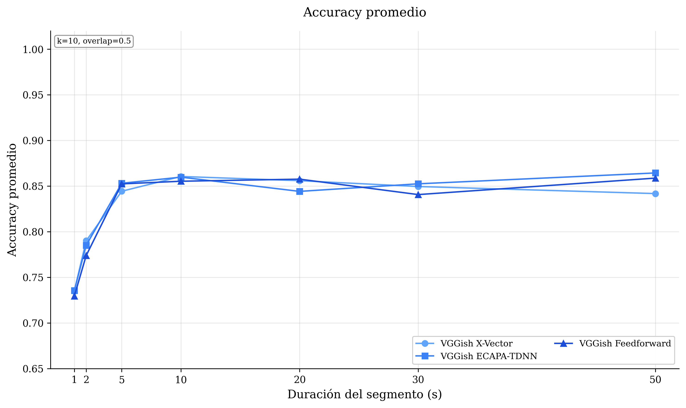
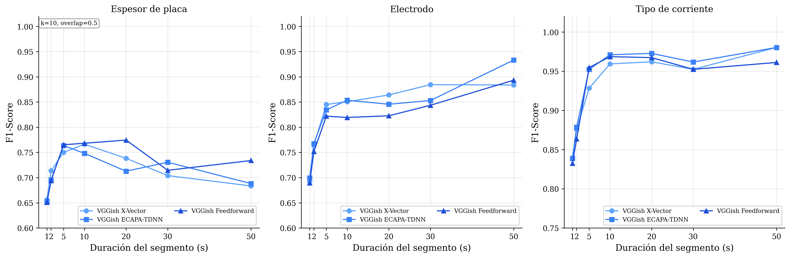
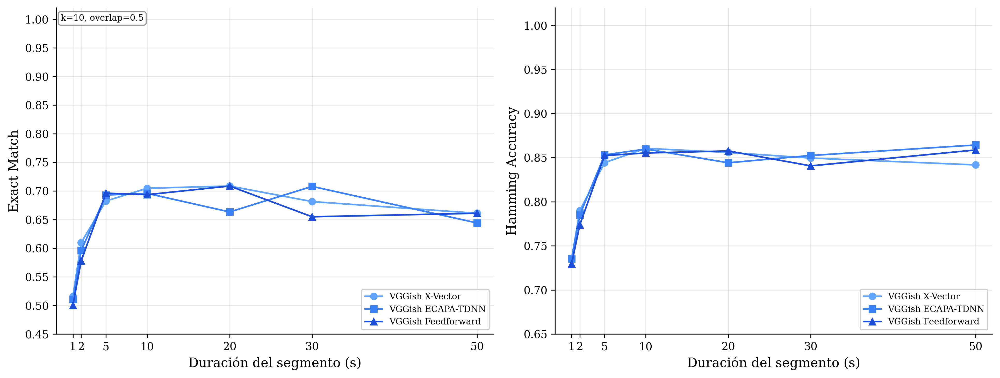
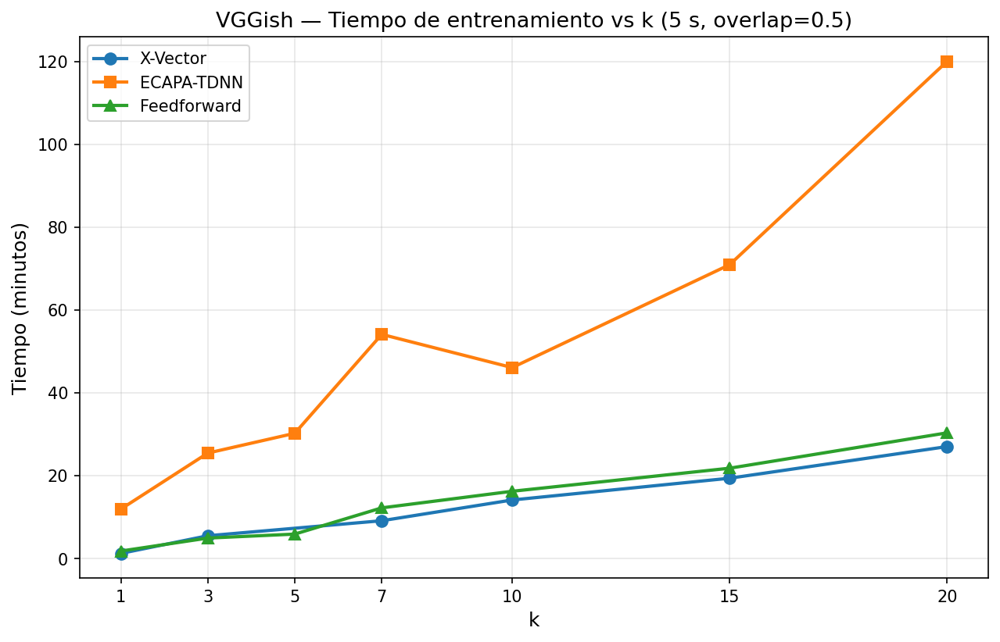

# VGGish — Resultados (Blind Set)

**Backbone:** VGGish (embeddings pre-entrenados)  
**Configuración:** k-fold = 10, overlap = 0.5  
**Datos:** `inferencia.json` (conjunto ciego)

---

## Mejor Modelo (5 s): ECAPA-TDNN

| Métrica            |    Valor    |
| ------------------ | :---------: |
| Exact Match        | **69.30 %** |
| Hamming Accuracy   | **85.31 %** |
| Plate Accuracy     |   75.71 %   |
| Electrode Accuracy |   84.65 %   |
| Current Accuracy   |   95.58 %   |

---

## Comparación de Arquitecturas (5 s)

| Modelo         | Plate Acc | Electrode Acc | Current Acc | Exact Match | Hamming Acc |
| -------------- | :-------: | :-----------: | :---------: | :---------: | :---------: |
| X-Vector       |  74.45 %  |    85.59 %    |   93.27 %   |   68.24 %   |   84.44 %   |
| **ECAPA-TDNN** |  75.71 %  |    84.65 %    |   95.58 %   | **69.30 %** | **85.31 %** |
| Feedforward    |  76.03 %  |    83.91 %    |   95.79 %   |   69.61 %   |   85.24 %   |

---

## Resultados por Duración

### X-Vector

| Duración | Plate Acc | Electrode Acc | Current Acc | Exact Match | Hamming Acc |
| :------: | :-------: | :-----------: | :---------: | :---------: | :---------: |
|   1 s    |  65.10 %  |    70.83 %    |   84.54 %   |   51.62 %   |   73.49 %   |
|   2 s    |  70.83 %  |    78.05 %    |   88.15 %   |   60.97 %   |   79.01 %   |
|   5 s    |  74.45 %  |    85.59 %    |   93.27 %   |   68.24 %   |   84.44 %   |
|   10 s   |  76.06 %  |    85.91 %    |   96.20 %   |   70.47 %   |   86.06 %   |
|   20 s   |  73.37 %  |    86.93 %    |   96.48 %   |   70.85 %   |   85.59 %   |
|   30 s   |  69.91 %  |    89.38 %    |   95.58 %   |   68.14 %   |   84.96 %   |
|   50 s   |  67.80 %  |    86.44 %    |   98.31 %   |   66.10 %   |   84.18 %   |

### ECAPA-TDNN

| Duración | Plate Acc | Electrode Acc | Current Acc | Exact Match | Hamming Acc |
| :------: | :-------: | :-----------: | :---------: | :---------: | :---------: |
|   1 s    |  64.74 %  |    71.49 %    |   84.44 %   |   51.08 %   |   73.56 %   |
|   2 s    |  68.97 %  |    78.13 %    |   88.44 %   |   59.59 %   |   78.51 %   |
|   5 s    |  75.71 %  |    84.65 %    |   95.58 %   |   69.30 %   |   85.31 %   |
|   10 s   |  74.27 %  |    86.35 %    |   97.32 %   |   69.57 %   |   85.98 %   |
|   20 s   |  70.85 %  |    84.92 %    |   97.49 %   |   66.33 %   |   84.42 %   |
|   30 s   |  72.57 %  |    86.73 %    |   96.46 %   |   70.80 %   |   85.25 %   |
|   50 s   |  67.80 %  |    93.22 %    |   98.31 %   |   64.41 %   |   86.44 %   |

### Feedforward

| Duración | Plate Acc | Electrode Acc | Current Acc | Exact Match | Hamming Acc |
| :------: | :-------: | :-----------: | :---------: | :---------: | :---------: |
|   1 s    |  64.68 %  |    70.35 %    |   83.80 %   |   50.04 %   |   72.94 %   |
|   2 s    |  68.84 %  |    76.47 %    |   86.86 %   |   57.81 %   |   77.39 %   |
|   5 s    |  76.03 %  |    83.91 %    |   95.79 %   |   69.61 %   |   85.24 %   |
|   10 s   |  76.29 %  |    83.22 %    |   97.09 %   |   69.35 %   |   85.53 %   |
|   20 s   |  76.88 %  |    83.42 %    |   96.98 %   |   70.85 %   |   85.76 %   |
|   30 s   |  70.80 %  |    85.84 %    |   95.58 %   |   65.49 %   |   84.07 %   |
|   50 s   |  71.19 %  |    89.83 %    |   96.61 %   |   66.10 %   |   85.88 %   |

---

## Tiempos de Extracción de Características

| Duración | Tiempo (s) | Segmentos |
| :------: | :--------: | :-------: |
|   1 s    |   235.50   |  21 686   |
|   2 s    |   198.87   |  10 756   |
|   5 s    |   175.91   |   4 186   |
|   10 s   |   154.14   |   2 004   |
|   20 s   |   248.88   |   1 640   |
|   30 s   |   207.50   |    918    |
|   50 s   |   177.14   |    448    |

---

## Gráficas

Las siguientes gráficas muestran el rendimiento de evaluación sobre el conjunto ciego usando métricas globales y por tarea según la duración del segmento de audio. El modelo evaluado pertenece únicamente a la arquitectura probada.

### Accuracy por duración

### F1-score por duración

### Métricas globales (Exact Match y Hamming Accuracy)

---

### Tiempos de extracción de características por duración

Tiempo de extracción total y por archivo según duración del segmento:

| Duración | Tiempo total (s) | Segmentos | ms/archivo |
| :------: | :--------------: | :-------: | :--------: |
|   1 s    |      235.50      |  21 686   |   10.86    |
|   2 s    |      198.87      |  10 756   |   18.49    |
|   5 s    |      175.91      |   4 186   |   42.02    |
|   10 s   |      154.14      |   2 004   |   76.92    |
|   20 s   |      248.88      |   1 640   |   151.76   |
|   30 s   |      207.50      |    918    |   226.03   |
|   50 s   |      177.14      |    448    |   395.40   |

### Tiempos de entrenamiento por duración

Tiempo de entrenamiento (k=10, overlap=0.5) por arquitectura según duración del segmento:

| Duración | X-Vector (s) | ECAPA-TDNN (s) | Feedforward (s) | X-Vector (min) | ECAPA-TDNN (min) | Feedforward (min) |
| :------: | :----------: | :------------: | :-------------: | :------------: | :--------------: | :---------------: |
|   1 s    |    4451.5    |    11674.5     |     7324.3      |     74.19      |      194.58      |      122.07       |
|   2 s    |    1052.8    |     5416.9     |     2184.3      |     17.55      |      90.28       |       36.41       |
|   5 s    |     N/D      |     2765.3     |      974.5      |      N/D       |      46.09       |       16.24       |
|   10 s   |    602.3     |     1415.9     |      445.5      |     10.04      |      23.60       |       7.43        |
|   20 s   |    187.0     |     570.2      |      200.9      |      3.12      |       9.50       |       3.35        |
|   30 s   |    119.6     |     319.4      |      127.6      |      1.99      |       5.32       |       2.13        |
|   50 s   |     90.2     |     179.2      |      89.0       |      1.50      |       2.99       |       1.48        |

### Tiempos de entrenamiento vs k (5 s, overlap=0.5)

Tiempo de entrenamiento por arquitectura para Study 2 (duración fija 5 s), usando datos de `resultados.json`.

|  k  | X-Vector (s) | ECAPA-TDNN (s) | Feedforward (s) | X-Vector (min) | ECAPA-TDNN (min) | Feedforward (min) |
| :-: | :----------: | :------------: | :-------------: | :------------: | :--------------: | :---------------: |
|  1  |    74.39     |     715.90     |     108.71      |      1.24      |      11.93       |       1.81        |
|  3  |    330.39    |    1527.62     |     296.60      |      5.51      |      25.46       |       4.94        |
|  5  |     N/D      |    1814.12     |     354.21      |      N/D       |      30.24       |       5.90        |
|  7  |    547.75    |    3246.55     |     734.07      |      9.13      |      54.11       |       12.23       |
| 10  |    848.37    |    2765.47     |     974.52      |     14.14      |      46.09       |       16.24       |
| 15  |   1163.45    |    4255.98     |     1308.50     |     19.39      |      70.93       |       21.81       |
| 20  |   1621.59    |    7200.05     |     1820.57     |     27.03      |      120.00      |       30.34       |

### Tiempos de inferencia por archivo (5 s, k=10, overlap=0.5)

Tiempo de inferencia sobre el conjunto ciego en segmentos de 5 s:

| Arquitectura | Tiempo total (s) | s/archivo | ms/archivo |
| ------------ | :--------------: | :-------: | :--------: |
| X-Vector     |      68.49       |   0.072   |   72.02    |
| ECAPA-TDNN   |      147.11      |   0.155   |   154.69   |
| Feedforward  |      54.05       |   0.057   |   56.83    |

