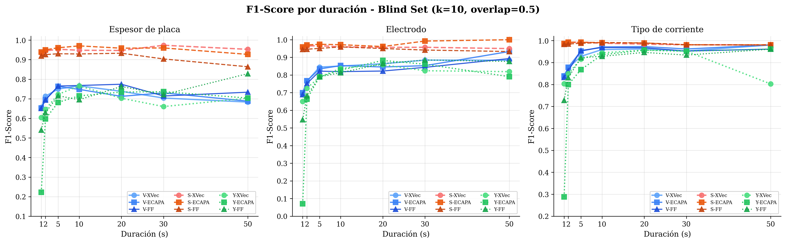
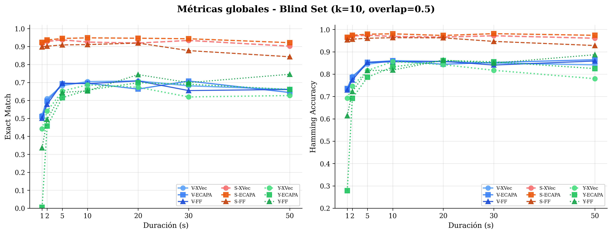
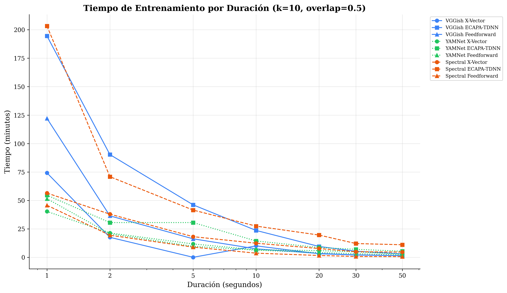
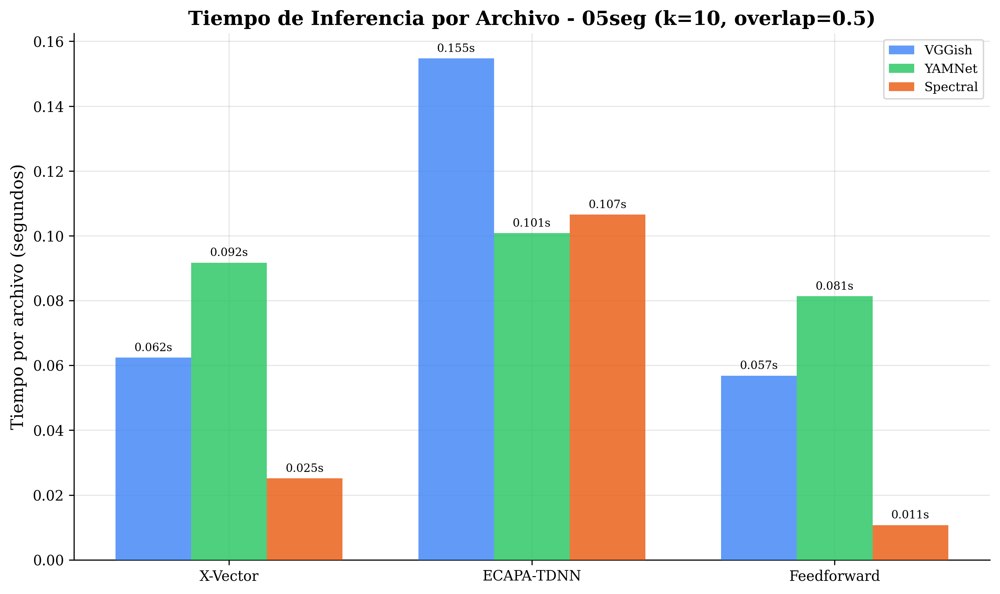

# VGGish — Resultados (Blind Set)

**Backbone:** VGGish (embeddings pre-entrenados)  
**Configuración:** k-fold = 10, overlap = 0.5  
**Datos:** `inferencia.json` (conjunto ciego)

---

## Mejor Modelo (5 s): ECAPA-TDNN

| Métrica            |    Valor    |
| ------------------ | :---------: |
| Exact Match        | **69.30 %** |
| Hamming Accuracy   | **85.31 %** |
| Plate Accuracy     |   75.71 %   |
| Electrode Accuracy |   84.65 %   |
| Current Accuracy   |   95.58 %   |

---

## Comparación de Arquitecturas (5 s)

| Modelo         | Plate Acc | Electrode Acc | Current Acc | Exact Match | Hamming Acc |
| -------------- | :-------: | :-----------: | :---------: | :---------: | :---------: |
| X-Vector       |  74.45 %  |    85.59 %    |   93.27 %   |   68.24 %   |   84.44 %   |
| **ECAPA-TDNN** |  75.71 %  |    84.65 %    |   95.58 %   | **69.30 %** | **85.31 %** |
| Feedforward    |  76.03 %  |    83.91 %    |   95.79 %   |   69.61 %   |   85.24 %   |

---

## Resultados por Duración

### X-Vector

| Duración | Plate Acc | Electrode Acc | Current Acc | Exact Match | Hamming Acc |
| :------: | :-------: | :-----------: | :---------: | :---------: | :---------: |
|   1 s    |  65.10 %  |    70.83 %    |   84.54 %   |   51.62 %   |   73.49 %   |
|   2 s    |  70.83 %  |    78.05 %    |   88.15 %   |   60.97 %   |   79.01 %   |
|   5 s    |  74.45 %  |    85.59 %    |   93.27 %   |   68.24 %   |   84.44 %   |
|   10 s   |  76.06 %  |    85.91 %    |   96.20 %   |   70.47 %   |   86.06 %   |
|   20 s   |  73.37 %  |    86.93 %    |   96.48 %   |   70.85 %   |   85.59 %   |
|   30 s   |  69.91 %  |    89.38 %    |   95.58 %   |   68.14 %   |   84.96 %   |
|   50 s   |  67.80 %  |    86.44 %    |   98.31 %   |   66.10 %   |   84.18 %   |

### ECAPA-TDNN

| Duración | Plate Acc | Electrode Acc | Current Acc | Exact Match | Hamming Acc |
| :------: | :-------: | :-----------: | :---------: | :---------: | :---------: |
|   1 s    |  64.74 %  |    71.49 %    |   84.44 %   |   51.08 %   |   73.56 %   |
|   2 s    |  68.97 %  |    78.13 %    |   88.44 %   |   59.59 %   |   78.51 %   |
|   5 s    |  75.71 %  |    84.65 %    |   95.58 %   |   69.30 %   |   85.31 %   |
|   10 s   |  74.27 %  |    86.35 %    |   97.32 %   |   69.57 %   |   85.98 %   |
|   20 s   |  70.85 %  |    84.92 %    |   97.49 %   |   66.33 %   |   84.42 %   |
|   30 s   |  72.57 %  |    86.73 %    |   96.46 %   |   70.80 %   |   85.25 %   |
|   50 s   |  67.80 %  |    93.22 %    |   98.31 %   |   64.41 %   |   86.44 %   |

### Feedforward

| Duración | Plate Acc | Electrode Acc | Current Acc | Exact Match | Hamming Acc |
| :------: | :-------: | :-----------: | :---------: | :---------: | :---------: |
|   1 s    |  64.68 %  |    70.35 %    |   83.80 %   |   50.04 %   |   72.94 %   |
|   2 s    |  68.84 %  |    76.47 %    |   86.86 %   |   57.81 %   |   77.39 %   |
|   5 s    |  76.03 %  |    83.91 %    |   95.79 %   |   69.61 %   |   85.24 %   |
|   10 s   |  76.29 %  |    83.22 %    |   97.09 %   |   69.35 %   |   85.53 %   |
|   20 s   |  76.88 %  |    83.42 %    |   96.98 %   |   70.85 %   |   85.76 %   |
|   30 s   |  70.80 %  |    85.84 %    |   95.58 %   |   65.49 %   |   84.07 %   |
|   50 s   |  71.19 %  |    89.83 %    |   96.61 %   |   66.10 %   |   85.88 %   |

---

## Tiempos de Extracción de Características

| Duración | Tiempo (s) | Segmentos |
| :------: | :--------: | :-------: |
|   1 s    |   235.50   |  21 686   |
|   2 s    |   198.87   |  10 756   |
|   5 s    |   175.91   |   4 186   |
|   10 s   |   154.14   |   2 004   |
|   20 s   |   248.88   |   1 640   |
|   30 s   |   207.50   |    918    |
|   50 s   |   177.14   |    448    |

---

## Gráficas

### Accuracy por duración

### F1-score por duración

### Métricas globales (Exact Match y Hamming)

### Comparación por backbone

### Comparación por k-folds

### Comparación por overlap

### Tiempos de extracción

### Tiempos de entrenamiento

### Tiempos de inferencia

